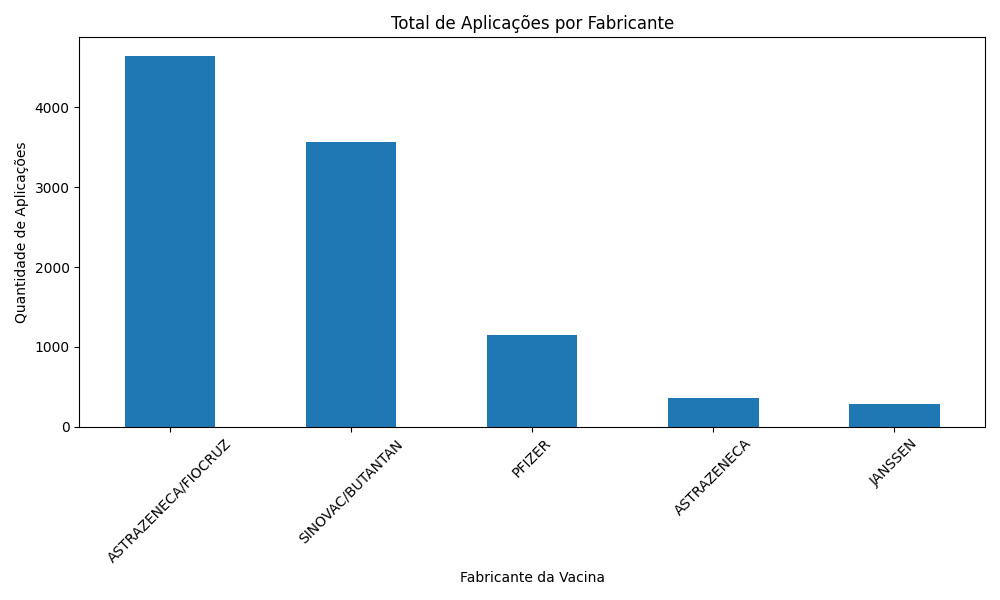
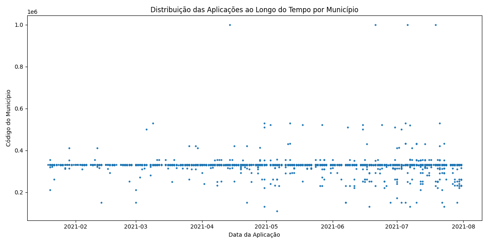

Projeto de Ingestão e Análise de Dados de Imunização COVID-19 no Cassandra

Este projeto tem como objetivo processar, limpar, ingerir e analisar dados de vacinação contra COVID-19 utilizando:

Apache Cassandra (cluster com 3 nós em Docker)

dsbulk (DataStax Bulk Loader)

Python + pandas + matplotlib

Visualização de dados (gráficos de barras e dispersão)

Dataset real do Kaggle, com 43 milhões de registros

 Repositório: https://github.com/Juniortech94/projeto_cassandra_imunizacao

 Dataset: https://www.kaggle.com/datasets/jsppimentel99/vacinao-covid-19-brasil-05-23

 Arquivo utilizado: Imu_COVID_RJ.csv

 Estrutura do Projeto
projeto_cassandra_imunizacao/
│
├── docker-compose.yml               # Cluster Cassandra com 3 nós
├── prepare_csv.py                   # Limpeza + padronização do CSV com pandas
├── amostragem.csv                   # Amostra usada para gráficos
├── scripts/
│   └── dsbulk.sh                    # Comandos de ingestão via dsbulk
│
├── graficos/
│   ├── grafico_barra.py             # Geração do gráfico de barras
│   └── grafico_dispersion.py        # Geração do gráfico de dispersão
│
└── README.md                       

 Objetivo do Projeto

O objetivo foi construir um pipeline completo de ingestão de dados massivos envolvendo:

Preparação dos dados com Python/pandas

Execução de um cluster Cassandra com 3 nós usando Docker

Criação do keyspace e tabelas para consultas

Ingestão de dados em larga escala usando o dsbulk

Visualização analítica para responder questões de negócio

 1. Preparação do Ambiente
 Subir o cluster Cassandra (3 nós)
docker compose up -d

 2. Estrutura da Tabela
CREATE KEYSPACE IF NOT EXISTS meu_projeto
WITH replication = {'class':'SimpleStrategy','replication_factor':3};

CREATE TABLE meu_projeto.imunizacao_covid (
    municipio int,
    data_aplicacao date,
    dose text,
    estabelecimento_municipio_codigo int,
    fabricante text,
    PRIMARY KEY (municipio, data_aplicacao)
);

Motivos do design:

municipio como partition key → garante distribuição e escalabilidade

data_aplicacao como clustering → permite análises por tempo

 3. Pré-processamento do CSV (pandas)

Arquivo: prepare_csv.py

Funções realizadas:

✔ Remoção de colunas irrelevantes
✔ Conversão de datas para o formato ISO
✔ Padronização dos nomes
✔ Exportação em CSV limpo para ingestão

Executar:
python prepare_csv.py
Gera o arquivo:
imu_COVID_RJ_prepared.csv

 4. Ingestão com DSBulk

Arquivo: scripts/dsbulk.sh

Exemplo de comando:

./dsbulk load \
  -h localhost \
  -k meu_projeto \
  -t imunizacao_covid \
  -url "imu_COVID_RJ_prepared.csv" \
  -header true \
  -delim "," \
  -m "municipio=municipio, estabelecimento_municipio_codigo=estabelecimento_municipio_codigo, data_aplicacao=vacina_dataAplicacao, fabricante=vacina_fabricante_nome, dose=vacina_descricao_dose"

📊 5. Visualizações de Dados (gráficos)

📌 **Gráfico de Barras — Aplicações por Fabricante**  

Resultado: mostra qual fabricante teve maior volume de vacina aplicada.

📌 **Gráfico de Dispersão — Data x Município**  

Resultado: permite visualizar o comportamento temporal da vacinação em diferentes municípios.

Conclusões

O Cassandra mostrou-se eficiente para ingestão massiva de dados (43 milhões de registros).

O dsbulk possibilitou ingestão paralela e otimizada, essencial para datasets grandes.

As visualizações permitiram identificar padrões relevantes para tomada de decisão.

